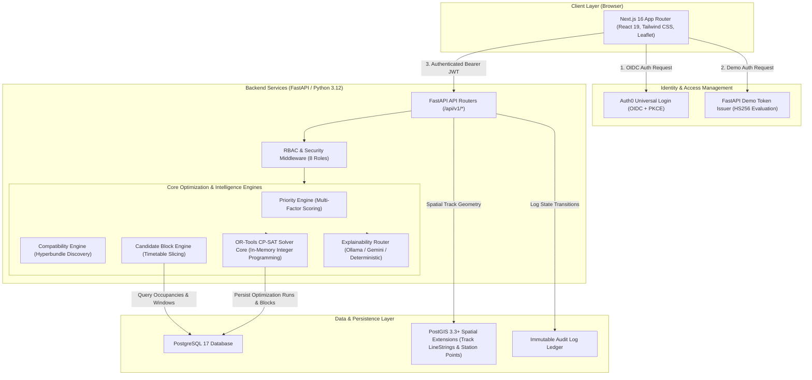

# RailOpt AI 🚆

**AI-Powered Automatic Maintenance Block Planning & Combinatorial Corridor Optimization for Indian Railways**

*Smart India Hackathon 2026 • Problem Statement ID: 26027 • Team Tech Mistris*

---

[](https://nextjs.org/)
[](https://react.dev/)
[](https://fastapi.tiangolo.com/)
[](https://www.python.org/)
[](https://www.postgresql.org/)
[](https://postgis.net/)
[](https://developers.google.com/optimization)
[](https://auth0.com/)
[](https://vercel.com/)
[](https://render.com/)
[](https://supabase.com/)

**RailOpt AI** is an intelligent Decision Support System (DSS) prototype developed for Indian Railways maintenance operations to automate and optimize multi-departmental railway maintenance possession planning. Benchmarked on Eastern Railway's **Howrah Division**, the platform consolidates siloed work orders from Civil Engineering (Permanent Way), Signaling & Telecommunications (S&T), and Overhead Electrification (TRD) into synchronized, train-conflict-free corridor possessions using Google OR-Tools CP-SAT integer programming, PostGIS spatial modeling, and grounded AI explainability.

---

## Table of Contents

1. [Problem Statement](#1-problem-statement)
2. [Our Solution](#2-our-solution)
3. [Key Capabilities](#3-key-capabilities)
4. [Why RailOpt AI](#4-why-railopt-ai)
5. [System Architecture](#5-system-architecture)
6. [End-to-End Data Flow](#6-end-to-end-data-flow)
7. [Technology Stack](#7-technology-stack)
8. [Optimization Engine (OR-Tools CP-SAT)](#8-optimization-engine-or-tools-cp-sat)
9. [AI & Explainability Architecture](#9-ai--explainability-architecture)
10. [Authentication, Authorization & Governance](#10-authentication-authorization--governance)
11. [GIS & Geospatial Layer](#11-gis--geospatial-layer)
12. [Application Modules](#12-application-modules)
13. [Repository Structure](#13-repository-structure)
14. [Data & Domain Model](#14-data--domain-model)
15. [Visual Interface & Workspaces](#15-visual-interface--workspaces)
16. [Live Evaluation & SIH Demo Workspace](#16-live-evaluation--sih-demo-workspace)
17. [Local Development Setup](#17-local-development-setup)
18. [Cloud Prototype Deployment Architecture](#18-cloud-prototype-deployment-architecture)
19. [Testing & Quality Assurance](#19-testing--quality-assurance)
20. [Operational Considerations & Performance](#20-operational-considerations--performance)
21. [Security & Governance Standards](#21-security--governance-standards)
22. [Project Maturity Status](#22-project-maturity-status)
23. [Future Scope & Roadmap](#23-future-scope--roadmap)
24. [Team & Mentorship](#24-team--mentorship)
25. [Academic Disclaimer & Attribution](#25-academic-disclaimer--attribution)
26. [Documentation Reference](#26-documentation-reference)

---

## 1. Problem Statement

### Smart India Hackathon 2026 • Problem Statement ID: 26027
> **"AI Powered Automatic Block Planning to Maximize Asset Availability for Train Operations on Indian Railways"**

Indian Railways operates one of the highest-density mixed rail networks in the world, running passenger and freight services over 68,000+ route kilometers. Ensuring track safety and asset reliability requires regular physical track access known as **traffic blocks** (possessions).

Under traditional operations, track block planning suffers from critical institutional challenges:
- **Departmental Fragmentation**: Maintenance requests are independently submitted by three isolated departments—**Civil Engineering / P-Way (TMS)**, **Signaling & Telecom (SMMS)**, and **Electrical / TRD (TDMS)**—without a unified cross-departmental scheduling framework.
- **Corridor Thrashing**: The same track corridor is closed multiple times on consecutive days for separate departmental tasks, multiplying passenger train cancellations, speed restrictions, and cascading delays.
- **Under-Utilized Traffic Blocks**: Granted track windows are frequently occupied by only a single department while adjacent work orders remain pending.
- **Timetable Conflicts**: Manual planners must review thousands of train schedules in the Control Office Application (COA), making it difficult to find optimal possession windows without delaying high-priority trains.
- **Combinatorial Complexity**: Evaluating tens of thousands of potential section-time window combinations against safety headways, task durations, and multi-department resource constraints exceeds human analytical capacity.

---

## 2. Our Solution

**RailOpt AI** bridges the gap between departmental maintenance requisitions and timetable-constrained train operations. It functions as a **Decision Support System (DSS)** that automates the discovery, compatibility grouping, and mathematical scheduling of joint maintenance possessions.

```
+-----------------------------------------------------------------------------------+
|                           TRADITIONAL MANUAL WORKFLOW                             |
|                                                                                   |
|  Civil (TMS) Work Orders   -----\                                                 |
|  S&T (SMMS) Work Orders    -----> [Manual Coordination] ---> 3 Separate Closures  |
|  TRD (TDMS) Work Orders    -----/                            Repeated Delays      |
+-----------------------------------------------------------------------------------+
                                          ↓
+-----------------------------------------------------------------------------------+
|                           RAILOPT AI OPTIMIZED WORKFLOW                           |
|                                                                                   |
|  Departmental Demands (Civil + S&T + TRD)                                         |
|         ↓                                                                         |
|  Compatibility & Dynamic Priority Scoring                                         |
|         ↓                                                                         |
|  Candidate Block Window Generation (Timetable-Aware COA Slicing)                  |
|         ↓                                                                         |
|  Google OR-Tools CP-SAT Combinatorial Optimization Engine                         |
|         ↓                                                                         |
|  Possession Readiness & Human Sign-off Gate (GO / HOLD / REDUCE)                  |
|         ↓                                                                         |
|  1 Synchronized Multi-Department Block (Max Asset Availability, Min Disruption)   |
|         ↓                                                                         |
|  Immutable Audit Trail & Grounded LLM Operational Explainability                  |
+-----------------------------------------------------------------------------------+
```

> **Core Principle**: RailOpt AI is designed to augment and empower railway controllers and divisional planners—**retaining strict human-in-the-loop governance**—rather than replacing human authority with an autonomous railway control system.

---

## 3. Key Capabilities

### Implemented Capabilities (Verified in Prototype)

- **Multi-Department Demand Consolidation**: Ingests, normalizes, and correlates maintenance requests across Civil Engineering, S&T, and TRD.
- **Dynamic Task Prioritization**: Calculates composite risk priority scores ($0.0 - 100.0$) evaluating defect severity, asset criticality, failure risk, overdue status, and operational speed impact.
- **Compatibility & Hyperbundle Discovery**: Identifies co-located maintenance tasks on shared track sections that can be safely executed within a single possession window without spatial conflict.
- **Timetable-Aware Candidate Block Generation**: Analyzes train section occupancy schedules to slice available corridor headways into candidate possession windows, pre-filtering train conflict overlaps.
- **Combinatorial CP-SAT Optimization**: Employs Google OR-Tools CP-SAT constraint programming to solve multi-objective integer programming schedules across hundreds of variables (measured at $< 3.0$ seconds on benchmark scenarios).
- **Interactive GIS Railway Map**: Visualizes Howrah Division track sections, passenger halts, junction stations, active defects, and scheduled possession zones using Leaflet and PostGIS spatial geometry.
- **Operations Planning Calendar & Timeline**: Provides interactive Gantt and multi-day dispatch grid views for station superintendents and section controllers.
- **Non-Destructive What-If Simulation**: Enables planners to evaluate alternative operational weight trade-offs (e.g., Strict Passenger Priority vs. Urgent Safety Clearance) without altering the baseline schedule.
- **Grounded LLM Explainability Copilot**: Delivers natural language operational summaries and unassigned-task diagnostics using local Ollama (`gemma2:2b`) or cloud Google Gemini (`gemini-2.5-flash`) with XML prompt boundaries.
- **Deterministic AI Fallback Engine**: Guarantees 100% offline operational explainability via a rule-based synthesis engine if external LLM services are unavailable.
- **Role-Based Access Control (RBAC)**: Enforces deny-by-default access control across 8 distinct railway operational roles via Auth0 OIDC PKCE and JWT claims.
- **Governance Sign-off & Audit Trail**: Implements a strict state machine (`DRAFT` $\rightarrow$ `SUBMITTED` $\rightarrow$ `APPROVED` / `REJECTED`) with immutable PostgreSQL audit logging.
- **SIH Demo Workspace**: Provides a pre-configured role selector allowing evaluators to test all 8 perspectives with instant, server-signed evaluation tokens.

### Planned / Future Extensions

- **Counterfactual Postpone Engine**: Algorithmic suggestions for deferrable non-critical work orders when high-priority emergency possessions cause corridor congestion.
- **Real-Time IoT Telemetry Ingestion**: Automated ingestion of track geometry car feeds and OHE sensor data for predictive block scheduling.
- **Zone-Wide Inter-Division Scaling**: Multi-division boundary coordination across adjacent railway divisions (e.g., Howrah $\leftrightarrow$ Sealdah $\leftrightarrow$ Asansol).

---

## 4. Why RailOpt AI

| Operational Dimension | Traditional Manual Operations | RailOpt AI Optimization |
|---|---|---|
| **Possession Coordination** | Fragmented, single-department track requests | Coordinated multi-departmental hyperbundles |
| **Corridor Thrashing** | High; same track blocked multiple times per week | Minimized; tasks bundled into unified windows |
| **Timetable Protection** | Manual visual inspection of train charts | Algorithmic train conflict avoidance |
| **Asset Availability** | Sub-optimal; extended idle track downtime | Maximized; higher maintenance yield per block |
| **Decision Speed** | Hours/days of inter-departmental meetings | Fast algorithmic CP-SAT solve ($\approx 2.5$–$3.0$s benchmarked) |
| **Governance & Compliance** | Paper-based notes and verbal clearance | Immutable digital audit trail & sign-offs |

---

## 5. System Architecture



---

## 6. End-to-End Data Flow

```
1. Master Data Ingestion
   └── Howrah Division track sections, station coordinates, assets, and timetable occupancies are loaded into PostGIS/PostgreSQL.

2. Maintenance Work Order Ingestion
   └── Civil, S&T, and TRD work orders are ingested with severity, duration, and equipment requirements.

3. Dynamic Priority & Compatibility Scoring
   └── PriorityEngine computes risk scores; CompatibilityEngine identifies co-locatable cross-departmental tasks.

4. Candidate Possession Window Generation
   └── CandidateBlockEngine cross-references corridor headways with train occupancies to construct feasible possession slots.

5. Mathematical Optimization (Google OR-Tools CP-SAT)
   └── OptimizerEngine executes multi-objective constraint satisfaction, generating an optimal schedule in seconds (< 3.0s on benchmark scenario).

6. Plan Inspection & What-If Exploration
   └── Planners inspect scheduled blocks on Gantt timelines and GIS maps, simulating alternative weight trade-offs.

7. Human Approval Governance Gate
   └── Authorized planners submit the plan (DRAFT → SUBMITTED); Divisional Approvers review and grant formal approval (APPROVED).

8. Immutable Audit Recording
   └── All status transitions, solver triggers, and approval actions are immutably recorded in the PostgreSQL audit log.

9. Grounded Explainability
   └── ExplainabilityService synthesizes operational summaries and unassigned-task rationales via LLM / deterministic fallback.
```

---

## 7. Technology Stack

| Layer | Technology | Purpose |
|---|---|---|
| **Frontend Framework** | **Next.js 16** (App Router, Turbopack) | Modern React server & client components with route protection |
| **UI & Styling** | **React 19**, **Tailwind CSS v4**, **Lucide React** | High-density operational dashboard and component styling |
| **Client State & Cache** | **TanStack Query v5** | Declarative asynchronous API data fetching, caching, and state decoupling |
| **Geospatial & Mapping** | **Leaflet 1.9**, **React-Leaflet** | Client-side interactive track network, asset, and possession visualization |
| **Backend Framework** | **FastAPI 0.141**, **Python 3.12+** | High-performance asynchronous REST API with Pydantic v2 schemas |
| **Optimization Engine** | **Google OR-Tools 9.15 (CP-SAT)** | Deterministic multi-objective constraint programming and MIP solver |
| **Database & GIS** | **PostgreSQL 17** + **PostGIS 3.3+** | Relational data persistence with spatial `LineString` and `Point` types |
| **ORM & Migrations** | **SQLAlchemy 2.0** (Async), **Alembic** | Type-safe asynchronous database modeling and schema migrations |
| **Authentication (Standard / SSO)** | **Auth0** (OIDC + PKCE + RS256 JWKS) | Cloud OIDC authentication with custom RBAC role claims |
| **Authentication (Evaluation)** | **FastAPI Demo Token Issuer** (HS256 JWT) | SIH evaluation workspace for instant 8-role perspective testing |
| **Local AI Runtime** | **Ollama** (`gemma2:2b`) | Air-gapped, zero-cloud-token operational natural language explainability |
| **Hosted AI Fallback** | **Google Gemini API** (`gemini-2.5-flash`) | Cloud-hosted explainability fallback for hosted prototype deployments |
| **Local Tooling & Containers** | **Docker** & **Docker Compose** | Local development orchestration for PostgreSQL/PostGIS (and optional local Keycloak/Ollama services; cloud deployment uses Auth0 OIDC) |
| **Cloud Hosting (Frontend)** | **Vercel** | Global edge hosting for Next.js web application |
| **Cloud Hosting (Backend)** | **Render** | Cloud container web service for FastAPI backend and CP-SAT engine |
| **Cloud Database** | **Supabase** | Managed PostgreSQL 17 database with PostGIS extensions |

---

## 8. Optimization Engine (OR-Tools CP-SAT)

The optimization engine ([`services/api/app/services/optimizer_engine.py`](services/api/app/services/optimizer_engine.py)) models maintenance planning as a **Constraint Satisfaction and Mixed-Integer Programming** problem solved by **Google OR-Tools CP-SAT**.

```
Candidate Possession Windows + Maintenance Tasks + Timetable Occupancies
                               ↓
                 Google OR-Tools CP-SAT Solver
                               ↓
         1. Single Task Assignment Invariant: Σ x_{i,b} <= 1
         2. Section Exclusivity Invariant: Overlaps(b1, b2) => y_b1 + y_b2 <= 1
         3. Duration Feasibility Invariant: Duration(b) >= max(d_i)
         4. Planning Horizon Boundary Invariant: T_start <= Start(b) < End(b) <= T_end
                               ↓
       Optimized Multi-Department Schedule (< 3.0s Execution on Benchmark Scenario)
```

### Mathematical Formulation

#### Decision Variables
- $y_b \in \{0, 1\}$: Binary variable indicating whether candidate possession block $b$ is activated.
- $x_{i,b} \in \{0, 1\}$: Binary variable indicating whether maintenance work order $i$ is assigned to block $b$.

#### Objective Function
The solver maximizes maintenance completion value while penalizing train disruption, freight loss, and idle window duration:

$$\max Z = \sum_{b \in \mathcal{B}} \left( W_{\text{pri}} \cdot P(b) + W_{\text{int}} \cdot B_{\text{int}}(b) + W_{\text{tasks}} \cdot N_{\text{tasks}}(b) \right) - \sum_{b \in \mathcal{B}} \left( W_{\text{disr}} \cdot D_{\text{train}}(b) + W_{\text{frt}} \cdot D_{\text{freight}}(b) + W_{\text{idle}} \cdot U(b) \right)$$

Where:
- $P(b)$: Realized priority score of tasks assigned to block $b$.
- $B_{\text{int}}(b)$: Multi-department integration bonus awarded when tasks from $\ge 2$ departments share block $b$.
- $N_{\text{tasks}}(b)$: Total number of distinct work orders scheduled in block $b$.
- $D_{\text{train}}(b)$: Passenger timetable disruption score based on train occupancy overlap.
- $D_{\text{freight}}(b)$: Freight throughput penalty on the corridor.
- $U(b)$: Unused idle duration within the allocated block window.

*Note: In the CP-SAT engine, objective weights are scaled by `OBJECTIVE_SCALE = 1000` to preserve exact integer arithmetic.*

#### Hard Operational Invariants (Protected Constraints)
1. **At-Most-Once Scheduling**: Each maintenance task is assigned to at most one block: $\sum_{b} x_{i,b} \le 1$.
2. **Section Exclusivity**: No two overlapping blocks may occupy the same physical track section: $\forall b_1, b_2 \in \mathcal{B}, \text{Overlaps}(b_1, b_2) \implies y_{b_1} + y_{b_2} \le 1$.
3. **Activation Implication**: Tasks can only be scheduled in activated blocks: $x_{i,b} \le y_b$.
4. **Duration Feasibility**: The duration of an activated block must satisfy the longest required task duration: $\text{Duration}(b) \ge \max_{i \in b} d_i$.
5. **Planning Horizon Invariant**: All block intervals must strictly lie within the active planning horizon $[T_{\text{start}}, T_{\text{end}}]$.

> [!IMPORTANT]
> **Google OR-Tools CP-SAT performs all deterministic mathematical scheduling and constraint optimization.** The AI/LLM layer has zero authority over optimization decisions, block timings, or safety constraints.

---

## 9. AI & Explainability Architecture

RailOpt AI integrates an **Explainability Layer** ([`services/api/app/services/explainability_service.py`](services/api/app/services/explainability_service.py)) to translate complex combinatorial optimization outputs into actionable, plain-language operational summaries for railway controllers and engineers.

### Core Principles & Safety Guardrails
1. **Zero Decision Authority**: The LLM functions purely as an advisory translation layer. It cannot modify schedules, alter weights, or override safety constraints.
2. **Anti-Hallucination Grounding**: Prompts are constructed using strictly verified database facts wrapped in `<UNTRUSTED_SYSTEM_DATA>` XML isolation tags with explicit system instructions forbidding the LLM from inventing train numbers, station names, or constraints.
3. **Provider Failover Hierarchy**:
   - **Primary**: Local **Ollama** (`gemma2:2b`) running locally for zero cloud token cost and air-gapped security.
   - **Secondary**: Hosted **Google Gemini API** (`gemini-2.5-flash`) for cloud deployments.
   - **Tertiary**: **Deterministic Template Engine** (100% reliable, zero-network rule-based synthesis that guarantees an explanation even with no AI connectivity).

---

## 10. Authentication, Authorization & Governance

RailOpt AI enforces a structured, **deny-by-default Role-Based Access Control (RBAC)** model across 8 distinct railway operational roles.

```
Incoming Request ──> Bearer JWT ──> Auth0 JWKS Validation ──> Role Claim Extraction ──> require_roles()
                                                                                               │
                                                                   ┌───────────────────────────┴───────────────────────────┐
                                                                   ▼                                                       ▼
                                                             Allowed Role                                           Forbidden Role
                                                           (Execute Action)                                      (HTTP 403 Forbidden)
```

### The 8 Railway Operational Roles

| Role | Operational Scope & Permissions |
|---|---|
| **ADMIN** | Full administrative and operational control across all modules and system configurations. |
| **PLANNER** | Full access to configure parameters, trigger CP-SAT optimization, and submit plans for sign-off. |
| **CONTROL** | Section controller access for corridor clearance, live conflict monitoring, and solver execution. |
| **APPROVER** | Divisional authority (DRM / Sr. DOM): Review optimization runs, formally approve, or reject with audit notes. |
| **ENGINEERING** | Civil Engineering / Permanent Way: View track defects, asset criticality, and track possession requests. |
| **SNT** | Signaling & Telecommunications: View signal defects, interlocking maintenance, and integration opportunities. |
| **TRD** | Traction Distribution: View overhead equipment (OHE) wear, power blocks, and electrical possessions. |
| **VIEWER** | Read-only access to published corridor possessions, Gantt calendars, and operational dashboards. |

### Auth0 OIDC Login vs. SIH Demo Workspace
- **Standard Auth0 Login**: Uses standard OIDC Authorization Code Flow with PKCE. Tokens are RS256-signed JWTs validated via Auth0's JSON Web Key Set (JWKS).
- **SIH Demo Workspace**: Designed for hackathon judges and evaluators. Issues time-bounded HS256 JWTs via `/api/v1/auth/demo-token` using a server-side secret (`DEMO_JWT_SECRET`), allowing instant role switching without managing credentials.

---

## 11. GIS & Geospatial Layer

The geospatial subsystem combines **PostGIS spatial database extensions** with **Leaflet / React-Leaflet** for interactive railway network visualization ([`services/web/src/app/map/page.tsx`](services/web/src/app/map/page.tsx)).

- **Spatial Topologies**:
  - **Track Sections**: Stored as PostGIS `LineString` geometries, rendered as interactive polyline tracks colored by electrification and operational status.
  - **Stations**: Stored as PostGIS `Point` coordinates, rendered as interactive markers with station codes and junction indicators.
  - **Defects & Assets**: Geocoded to specific track sections with severity badges.
  - **Possession Zones**: Highlighted corridor segments visually indicating active or candidate block closures.
- **Client-Side Rendering**: Dynamically loaded on the client (`ssr: false`) to prevent server-side DOM errors while providing responsive zoom, pan, and layer filtering.

---

## 12. Application Modules

The Next.js 16 frontend provides dedicated workspaces tailored to railway workflows:

| Route | Workspace Module | Purpose & Core Capabilities |
|---|---|---|
| `/login` | **Authentication & Demo Hub** | Auth0 Universal Login + 1-click 8-role SIH Demo Workspace selector. |
| `/dashboard` | **Executive Command Center** | Real-time operational KPIs, defect distribution charts, candidate blocks, and recent runs. |
| `/maintenance` | **Maintenance Workbench** | Multi-department work order ledger with filters (Civil, S&T, TRD), severity, and detail drawers. |
| `/planning` | **Planning & Opportunities** | Cross-department integration opportunities and candidate possession window generation. |
| `/planning/calendar` | **Dispatch Calendar** | Weekly scheduling grid and multi-day dispatch timeline. |
| `/optimization` | **Optimization Cockpit** | Parameter configuration, solver launch trigger, and historical optimization run ledger. |
| `/optimization/runs/[id]` | **Plan Details & Gantt** | Scheduled block distribution, task assignments, Gantt timeline, and explainability copilot. |
| `/optimization/runs/[id]/what-if` | **What-If Scenario Studio** | Non-destructive sensitivity analysis adjusting objective weights to compare plan trade-offs. |
| `/operations` | **Corridor Operations** | Real-time corridor possession timeline and train conflict monitoring. |
| `/map` | **Interactive Railway GIS** | Full Howrah Division network map with track lines, stations, defects, and possession overlays. |
| `/approvals` | **Governance & Sign-Off** | DRM / Approver review workbench to formally approve or reject plans with audit notes. |
| `/audit` | **Immutable Audit Trail** | Chronological ledger of all system events, state transitions, and user actions. |

---

## 13. Repository Structure

```
railopt-ai/
├── services/
│   ├── api/                           # FastAPI Backend Service (Python 3.12)
│   │   ├── alembic/                   # Database schema migrations
│   │   ├── app/
│   │   │   ├── core/                  # Configuration, security, RBAC dependencies
│   │   │   ├── domain/                # In-memory optimization contracts & domain types
│   │   │   ├── models/                # SQLAlchemy models (PostGIS geometry & entities)
│   │   │   ├── routers/               # API endpoint routers (/api/v1/*)
│   │   │   ├── schemas/               # Pydantic v2 request/response schemas
│   │   │   └── services/              # CP-SAT solver, candidate generation, explainability
│   │   ├── tests/                     # 17 Pytest backend test suites
│   │   ├── requirements.txt           # Python dependencies
│   │   └── run_server.py              # Windows-compatible Uvicorn async launcher
│   │
│   └── web/                           # Next.js 16 Web Application (React 19, TypeScript)
│       ├── src/
│       │   ├── app/                   # App Router pages (15 routes)
│       │   ├── components/            # UI components, layout, map, and charts
│       │   ├── hooks/                 # Custom React and TanStack Query hooks
│       │   └── lib/                   # API clients, Auth0/OIDC config, utilities
│       ├── package.json               # Node.js dependencies and scripts
│       └── vitest.config.ts           # Vitest frontend testing configuration
│
├── data/
│   └── raw/                           # Howrah Division benchmark dataset (.xlsx)
│
├── docs/                              # Comprehensive technical documentation & guides
│   ├── TEAMMATE_GUIDE.md              # 700-line internal engineering handbook
│   ├── TEAMMATE_GUIDE.pdf             # Formatted PDF engineering handbook
│   └── PERFORMANCE_AUDIT.md           # Architecture performance audit report
│
├── scripts/                           # Database seeding and smoke test scripts
│   ├── seed_data.py                   # Howrah Division master data seeder
│   └── run_production_smoke_test.py   # Automated end-to-end smoke test
│
├── docker-compose.yml                 # Local development PostgreSQL/PostGIS container
└── README.md                          # Repository documentation
```

---

## 14. Data & Domain Model

The database represents Indian Railways divisional infrastructure across 13 core relational tables:

```
                    ┌────────────────────┐
                    │      Division      │
                    └─────────┬──────────┘
                              │ 1:N
                              ▼
                    ┌────────────────────┐
                    │      Section       │ (PostGIS LineString Geometry)
                    └────┬──────────┬────┘
                         │          │
            1:N Belongs  │          │ 1:N Contains
                         ▼          ▼
                 ┌──────────┐    ┌───────────────┐
                 │  Station │    │     Asset     │ (Turnouts, Masts, Signals)
                 └──────────┘    └───────┬───────┘
                                         │ 1:N
                                         ▼
                                 ┌───────────────┐
                                 │MaintenanceTask│ (Civil, S&T, TRD Work Orders)
                                 └───────┬───────┘
                                         │
                        Included in      │ Scheduled in
                        Candidate        │ Optimized Block
                                         ▼
                                 ┌───────────────┐
                                 │OptimizedBlock │
                                 └───────┬───────┘
                                         │ N:1
                                         ▼
                                 ┌─────────────────┐
                                 │ OptimizationRun │ (DRAFT, SUBMITTED, APPROVED)
                                 └─────────────────┘
```

- **`divisions`**: Railway administrative division (e.g., `ER-HWH` Howrah Division).
- **`sections`**: Track sections between junctions with PostGIS `LineString` coordinates and speed limits.
- **`stations`**: Stations with 3-letter codes (e.g., `HWH`, `BWN`) and PostGIS `Point` coordinates.
- **`section_station_maps`**: Ordered sequence mapping stations to track kilometer markers.
- **`assets`**: Infrastructure assets (turnouts, track circuits, OHE masts) tied to departments.
- **`maintenance_tasks`**: Work orders with severity, duration, and speed restriction requirements.
- **`train_runs`**: Timetable train services and route metadata.
- **`train_section_occupancies`**: Detailed section entry/exit timestamps used for conflict detection.
- **`corridor_windows`**: Headway slots between scheduled trains.
- **`optimization_runs`**: Master record of a CP-SAT solve execution with state and objective metrics.
- **`optimized_blocks`**: Discrete scheduled traffic possessions.
- **`optimized_block_tasks`**: Junction table linking tasks to assigned possession blocks.
- **`audit_logs`**: Immutable ledger of all system state transitions and user actions.

> *Note: The master spreadsheet `data/raw/howrah_division_master_data.xlsx` is an offline seed artifact processed during initialization via `scripts/seed_data.py`.*

---

## 15. Visual Interface & Workspaces

> [!NOTE]
> UI captures of the RailOpt AI interface will be placed in `docs/screenshots/`. In the interim, evaluators can interact with the live deployed prototype directly at [https://railopt-ai-five.vercel.app](https://railopt-ai-five.vercel.app).

### Primary Application Workspaces

- **Executive Command Dashboard**: Real-time divisional KPI cards, task severity distributions, candidate blocks status, and quick-action shortcuts.
- **Planning & Combinatorial Optimization**: Multi-department hyperbundle discovery, candidate possession window generator, and CP-SAT solver results with interactive Gantt timeline.
- **Interactive Geospatial Railway Map**: Howrah Division track network, station nodes, geocoded defect markers, and highlighted possession zones rendered via Leaflet and PostGIS.
- **Multi-Department Governance & Audit Trail**: DRM / Approver formal sign-off workbench with immutable audit logging and action history.

---

## 16. Live Evaluation & SIH Demo Workspace

A live prototype deployment is hosted for Smart India Hackathon evaluators:

- **Live Web Application**: [https://railopt-ai-five.vercel.app](https://railopt-ai-five.vercel.app)
- **Backend API**: [https://railopt-ai-36j3.onrender.com](https://railopt-ai-36j3.onrender.com)
- **Interactive API Documentation**: [https://railopt-ai-36j3.onrender.com/docs](https://railopt-ai-36j3.onrender.com/docs)

### How to Evaluate via the SIH Demo Workspace

1. Open [https://railopt-ai-five.vercel.app/login](https://railopt-ai-five.vercel.app/login).
2. Under **DEMO ACCESS**, select any of the 8 railway roles (e.g. **Planner** to test optimization solving, or **Approver** to test governance sign-offs).
3. Click **"Enter Demo Workspace"**.
4. The backend issues a time-bounded evaluation JWT; the UI immediately adapts its sidebar, permissions, and buttons to match the selected role.

> *Notice: Production credentials, private keys, and API secrets are intentionally excluded from this repository.*

---

## 17. Local Development Setup

### Prerequisites
- **Python 3.12+**
- **Node.js 20+** & **npm**
- **Docker Desktop** (for local PostgreSQL/PostGIS)

### 1. Clone Repository & Setup Database
```bash
git clone https://github.com/farhanmd03/railopt-ai.git
cd railopt-ai

# Start local PostgreSQL with PostGIS extension
docker compose up -d
```

### 2. Backend Setup (FastAPI)
```bash
cd services/api

# Create and activate virtual environment
python -m venv .venv

# On Windows:
.venv\Scripts\activate
# On Linux / macOS:
# source .venv/bin/activate

# Install dependencies
pip install -r requirements.txt

# Apply database migrations
python -m alembic upgrade head

# Seed Howrah Division benchmark data
python ../../scripts/seed_data.py

# Launch FastAPI development server
python run_server.py
```
*Backend runs at `http://127.0.0.1:8000` (API documentation at `http://127.0.0.1:8000/docs`).*

### 3. Frontend Setup (Next.js)
```bash
# In a second terminal:
cd services/web

# Install dependencies
npm install

# Start Next.js development server
npm run dev
```
*Frontend application runs at `http://localhost:3000`.*

---

## 18. Production Cloud Deployment Architecture

```
                                [ End Users / Evaluators ]
                                            │
                    ┌───────────────────────┴───────────────────────┐
                    ▼                                               ▼
         [ Vercel Edge Network ]                          [ Auth0 Cloud Identity ]
         Next.js 16 Web Application                      Enterprise OIDC & PKCE
         (railopt-ai-five.vercel.app)                    (farhanmd03.us.auth0.com)
                    │                                               │
                    │ 1. Client Requests                            │ 2. OIDC Token Exchange
                    ▼                                               │
         [ Render Cloud Web Service ]                               │
         FastAPI + Google OR-Tools CP-SAT                           │
         (railopt-ai-36j3.onrender.com) ◄───────────────────────────┘
                    │                      3. Validate Bearer JWT via JWKS
                    ▼
         [ Supabase Managed Database ]
         PostgreSQL 17 + PostGIS 3.3 Spatial Engine
```

- **Vercel**: Hosts the Next.js 16 frontend with global edge CDN caching and Turbopack builds.
- **Render**: Runs the FastAPI backend in a Python 3.12 container executing the Google OR-Tools CP-SAT solver.
- **Supabase**: Managed PostgreSQL 17 database with PostGIS spatial extensions and SSL encryption.
- **Auth0**: Cloud OpenID Connect Identity Provider managing railway authentication and role claims.

---

## 19. Testing & Quality Assurance

The codebase includes automated test suites across both backend and frontend layers:

### Run Backend Pytest Suite (17 Suites)
```bash
cd services/api
python -m pytest tests/ -v
```
*Validates: CP-SAT mathematical invariants, candidate block window generation, multi-department compatibility logic, priority scoring, Auth0/RBAC authorization, and API contracts.*

### Run Frontend Vitest Suite (21 Suites, 146+ Tests)
```bash
cd services/web
npm test -- --run
```
*Validates: UI components, role extraction, route protection, permission hooks, and API client adapters.*

### Run Frontend TypeScript Compilation Check
```bash
cd services/web
npx tsc --noEmit
npm run build
```
*Validates: Strict zero-error TypeScript compilation and Next.js production build bundle generation.*

---

## 20. Operational Considerations & Performance

1. **Render Free-Tier Spin-Up**: The live prototype backend is hosted on Render's free tier, which enters sleep mode after periods of inactivity. Initial cold-start requests may take 30–50 seconds before returning `200 OK`.
2. **Decoupled Architecture**: Candidate block generation and CP-SAT optimization are strictly decoupled. The dashboard renders independently while heavy computational tasks execute asynchronously.
3. **Integer Arithmetic Scaling**: To prevent floating-point rounding errors during mathematical optimization, all continuous objective coefficients are scaled by `OBJECTIVE_SCALE = 1000` in CP-SAT.

---

## 21. Security & Governance Standards

- **Deny-by-Default Authorization**: All operational endpoints require explicit role claims via the `require_roles` dependency. Requests lacking valid claims receive `HTTP 403 Forbidden`.
- **Zero Hardcoded Secrets**: All database connection strings, JWT secrets, and API keys are loaded via environment variables and excluded from source control.
- **Isolated Evaluation Environment**: The SIH Demo Workspace issues time-bounded evaluation tokens that are strictly separated from production Auth0 identity stores.
- **Immutable Audit Logging**: Database triggers record all plan status changes (`DRAFT` $\rightarrow$ `SUBMITTED` $\rightarrow$ `APPROVED` / `REJECTED`) with timestamps and actor attribution.

---

## 22. Project Maturity Status

RailOpt AI is a **Smart India Hackathon 2026 prototype** demonstrating the core technical feasibility, mathematical optimization formulation, and end-to-end software architecture for automated railway block planning.

While the core CP-SAT solver, GIS mapping, multi-department compatibility algorithms, and RBAC governance are fully implemented and benchmarked on Howrah Division data, direct bidirectional adapters to Indian Railways enterprise production systems (live CRIS COA, TMS, and SMMS APIs) remain outside the hackathon prototype scope.

---

## 23. Future Scope & Roadmap

- [ ] **Live CRIS COA / TMS API Integration**: Direct live feed ingestion for real-time timetable updates and track defect logging.
- [ ] **Counterfactual Postpone Engine**: Automated recommendations for postponing low-priority tasks during emergency corridor disruptions.
- [ ] **Multi-Division Network Coordination**: Inter-division boundary possession handshakes (e.g., Howrah $\leftrightarrow$ Sealdah).
- [ ] **Locomotive & Crew Roster Awareness**: Incorporating maintenance machine (tamper, crane) and crew rest constraints into block scheduling.

---

## 24. Team & Mentorship

### Team — Tech Mistris
*5th Semester / 3rd Year B.Tech Students, Guru Nanak Institute of Technology (GNIT), Kolkata*

| Name | Discipline / Branch |
|---|---|
| **Md Farhan** | Computer Science & Engineering |
| **Misty Kumari** | Computer Science & Engineering |
| **Jiyashree Prasad** | Computer Science & Engineering |
| **Annyasha Pal** | Computer Science & Engineering (AI & ML) |
| **Ankita Jana** | Computer Science & Engineering (AI & ML) |
| **Priya Sharma** | Computer Science & Engineering (AI & ML) |

### Mentor
**Nilanjana Adhikari**<br/>
Assistant Professor, Guru Nanak Institute of Technology (GNIT), Kolkata

---

## 25. Academic Disclaimer & Attribution

Developed as a prototype for the **Smart India Hackathon (SIH) 2026** under Problem Statement ID `26027`.<br/>
Dataset benchmark: Eastern Railway (Howrah Division), Ministry of Railways, Government of India.

---

## 26. Documentation Reference

- **[Teammate & Developer Guide](docs/TEAMMATE_GUIDE.md)**: Comprehensive 700-line engineering handbook covering architecture, algorithms, and local setup.
- **[Teammate Guide (PDF)](docs/TEAMMATE_GUIDE.pdf)**: Formatted PDF edition of the engineering handbook.
- **[Architecture & Performance Audit](docs/PERFORMANCE_AUDIT.md)**: Deep-dive performance and optimization bottleneck audit report.
